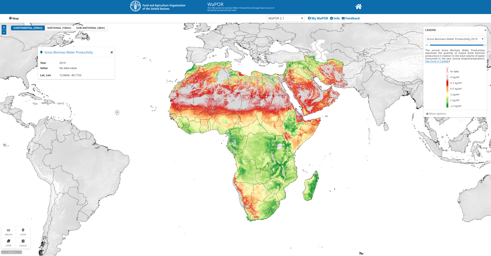

```{r setup, echo=F}
libs = c("sf", "knitr", "leaflet", "leaflet.extras", "leaflet.providers", 
         "magrittr", "ggplot2", "tidyr", "dplyr", "gridExtra", "plotly", "forcats")
for (lib in libs) {suppressPackageStartupMessages(library(lib, character.only = T))}
```

# About me
<style>
.reveal section img { background:none; border:none; box-shadow:none; }
</style>

##
- Darius Görgen
- B.A. Political Sciences & B.Sc. Geography @University of Marburg
- M.Sc. thesis: Predicting violent conflict induced by environmental changes
- Passionate about OpenSource, OpenData, OpenScience with R and Python
- [KfW intern position](https://kfw-jobs.de/index.php?ac=jobad&id=4681)
- slides @[https://github.com/goergen95/clca](https://github.com/goergen95/clca)

# What am I going to talk about?

## 
- ICARDA's project on conservation agriculture

- some basics of remote sensing

- exploring available data sets

- outline the work to be done

# Research project

## 
- ongoing [ICARDA project](https://mel.cgiar.org/uploads/projects/Or84HhEC38-100114%20IFAD%20CLCA_ICARDA_CIMMYT_Proposal%204.10.17%20for%20SEC%20clean%5B1%5D_vg.pdf) (2018 - 2022) financed by an [IFAD](https://www.ifad.org/en/) grant of 2.5 Mio. USD

- implementation of conservation agriculture practices to increase water use efficiency, soil protection and income

- ICARDA expressed interest in using RS technologies for ongoing M&E of key indicators of the project

- in the future: modeling of impacts on water balance and biomass productivity on water basin scale

## Conservation agriculture (CA)


<small class="caption">adapted from [FAO (2017)](http://www.fao.org/3/a-i7480e.pdf)</small>

##
- 180 Mio. ha (12.5%) of global cropland under CA practices in 2015 ([Kassam et. al (2018)](https://journals.openedition.org/factsreports/3966))
- criticism was expressed about the impact of CA on smallholder farms ([Giller et. al (2015)](https://www.frontiersin.org/articles/10.3389/fpls.2015.00870/full))

# Basics of Remote Sensing

---

```{r echo=F, out.width="100%"}

```

<small class="caption">Source: [Centre for Remote Imaging, Sensing & Processing](https://crisp.nus.edu.sg/~research/tutorial/optical.htm)</small>

---

```{r echo=F, out.width="70%"}

```

<small class="caption">Source: [NASA](https://mynasadata.larc.nasa.gov/basic-page/electromagnetic-spectrum-diagram)</small>


---

```{r echo=F, out.width="100%"}
include_graphics("assets/images/s2_spectral_response.png")
```

<small class="caption">Source: [ESA](https://earth.esa.int/web/sentinel/technical-guides/sentinel-2-msi/performance)</small>

---

- spectral resolution
- spatial resolution
- temporal resolution

# WaPOR Dataset

---

```{r echo=F, out.width="100%"}

```

<small class="caption">Source: [FAO WaPOR](https://wapor.apps.fao.org/home/WAPOR_2/1)</small>

---

```{r echo=F, out.width="100%"}
include_graphics("assets/images/wapor_scheme.png")
```

<small class="caption">Source: [FAO (2020)](http://www.fao.org/3/ca9894en/CA9894EN.pdf)</small>

---

```{r echo=F, out.width="75%"}

```

<small class="caption">Source: [FAO (2020)](http://www.fao.org/3/ca9894en/CA9894EN.pdf)</small>

# Area of Interest

---

```{r echo=F, fig.align="center"}
aoi = st_read("../data/wdpa/bouhedma.gpkg", quiet = TRUE )
aoi = st_transform(aoi,  st_crs("EPSG:32632"))
aoi_buffer = st_buffer(aoi, dist = 50000)
aoi = st_transform(aoi, st_crs(4326))
aoi_buffer = st_transform(aoi_buffer, st_crs(4326))
bbx = st_bbox(aoi_buffer)

leaflet()  %>%
  addProviderTiles(providers$Esri.WorldImagery) %>%
  addPolygons(data = aoi) %>%
  addPolygons(data = aoi_buffer, fill = FALSE)

```


# Precipitation Analysis

--- 

```{r read-data, echo=FALSE, include=F}
prec_m = readRDS("assets/data/prec_monthly.rds")
prec_y  = readRDS("assets/data/prec_yearly.rds")
spei = readRDS("assets/data/spei.rds")
nbwp = readRDS("assets/data/nbwp.rds")
tbp  = readRDS("assets/data/tbp.rds")
```

```{r, echo = FALSE}
ggplot(prec_y) +
  geom_bar(aes(x=year, y = prec), stat = "identity", position = "dodge", fill = "#034e7b")+
  labs(y = "(mm)", x = "Year" ) +
  theme_classic() -> p1

ggplot(prec_m) +
  geom_bar(aes(x=date, y = prec), stat = "identity", position = "dodge", fill = "#034e7b")+
  labs(y = "(mm)", x = "Year",title = "Yearly and monthly sum of precipitation") +
  theme_classic() -> p2

subplot(ggplotly(p1), ggplotly(p2), nrows = 2, titleY = TRUE)
```

---

```{r, echo = FALSE}

prec_y %>%
  ggplot(aes(x = year, y = anom, fill = sign)) + 
  geom_bar(stat = "identity", show.legend = FALSE) + 
  #scale_x_date(date_breaks = "year", date_labels = "%Y") +
  scale_y_continuous(breaks = seq(-100, 200, 20)) +
  scale_fill_manual(values = c("#99000d", "#034e7b")) +
  labs(y = "(mm)", x = "Year") +
  theme_classic() -> p3

prec_m %>%
  mutate(sign =  ifelse(anom > 0, "pos", "neg")) %>%
  ggplot(aes(x = date, y = anom, fill = sign)) + 
  geom_bar(stat = "identity", show.legend = FALSE) + 
  #scale_x_date(date_breaks = "year", date_labels = "%Y") +
  scale_y_continuous(breaks = seq(-50, 100, 20)) +
  scale_fill_manual(values = c("#99000d", "#034e7b")) +
  labs(y = "(mm)", x = "Year", title = "Yearly and monthly precipitation anomalies") +
  theme_classic() -> p4


subplot(style(ggplotly(p3), showlegend = FALSE), style(ggplotly(p4), showlegend = FALSE), nrows = 2, titleY = TRUE)
```

---

```{r, echo=FALSE, warning=FALSE, message=FALSE, fig.width=9, fig.height=7}

spei %>%
  gather(scale, value, -date) %>%
  separate(scale, into = c("var", "para"), sep = "_") %>%
  separate(var, into = c("var", "scale"), sep = "m") %>%
  dplyr::select(-para) %>%
  mutate(cap = paste0("Scale of ", scale, " months"),
         scale = as.numeric(scale)) %>%
  mutate(cap = fct_reorder(cap, scale, min)) %>%
  mutate(sign =  ifelse(value > 0, "pos", "neg")) -> plt_data

plt_data %>%
  filter(scale == 1) %>%
  ggplot(aes(date, value, fill = sign)) + 
  geom_bar(stat = "identity", show.legend = FALSE) + 
  #scale_x_date(date_breaks = "year", date_labels = "%Y") +
  scale_y_continuous(breaks = seq(-10, 10, 1)) +
  scale_fill_manual(values = c("#99000d", "#034e7b")) +
  labs(y = "SPEI", x = "") +
  theme_classic() +
  facet_wrap(~cap, nrow = 1) -> p5

plt_data %>%
  filter(scale == 3) %>%
  ggplot(aes(date, value, fill = sign)) + 
  geom_bar(stat = "identity", show.legend = FALSE) + 
  #scale_x_date(date_breaks = "year", date_labels = "%Y") +
  scale_y_continuous(breaks = seq(-10, 10, 1)) +
  scale_fill_manual(values = c("#99000d", "#034e7b")) +
  labs(y = "SPEI", x = "") +
  theme_classic() +
  facet_wrap(~cap, nrow = 1) -> p6

plt_data %>%
  filter(scale == 6) %>%
  ggplot(aes(date, value, fill = sign)) + 
  geom_bar(stat = "identity", show.legend = FALSE) + 
  #scale_x_date(date_breaks = "year", date_labels = "%Y") +
  scale_y_continuous(breaks = seq(-10, 10, 1)) +
  scale_fill_manual(values = c("#99000d", "#034e7b")) +
  labs(y = "SPEI", x = "") +
  theme_classic() +
  facet_wrap(~cap, nrow = 1) -> p7

plt_data %>%
  filter(scale == 12) %>%
  ggplot(aes(date, value, fill = sign)) + 
  geom_bar(stat = "identity", show.legend = FALSE) + 
  #scale_x_date(date_breaks = "year", date_labels = "%Y") +
  scale_y_continuous(breaks = seq(-10, 10, 1)) +
  scale_fill_manual(values = c("#99000d", "#034e7b")) +
  labs(y = "SPEI", x = "",
       title = "Standardised Precipitation-Evapotranspiration Index (SPEI) at different time scales") +
  theme_classic() +
  facet_wrap(~cap, nrow = 1) -> p8

subplot(style(ggplotly(p5), showlegend = FALSE), style(ggplotly(p6), showlegend = FALSE),
        style(ggplotly(p7), showlegend = FALSE), style(ggplotly(p8), showlegend = FALSE), nrows = 4, shareX = T, shareY = T)
```

# Water Productivity Analysis

---

```{r, echo=FALSE}
nbwp %>%
  mutate(title = "Net Biomass Water Productivity (kg/m³)") %>%
  ggplot()+
  geom_bar(aes(y=value, x=year, fill = season, group=season), stat = "identity", position = "dodge")+
  scale_fill_manual(values = c("darkseagreen", "darkolivegreen4")) +
  labs(y="(kg/m³)") +
  facet_wrap(~title) +
  theme_classic() -> p9

tbp %>%
  mutate(title = "Total Biomass Production (kg/ha)") %>%
  ggplot() +
  geom_bar(aes(y=value, x=year, fill=season, group=season), stat = "identity", position = "dodge")+
  scale_fill_manual(values = c("darkseagreen", "darkolivegreen4")) +
  labs(y="(kg/ha)") +
  facet_wrap(~title) +
  theme_classic() -> p10

subplot(style(ggplotly(p10), showlegend = FALSE), 
        style(ggplotly(p9), showlegend = T),
        nrows = 2)
```
